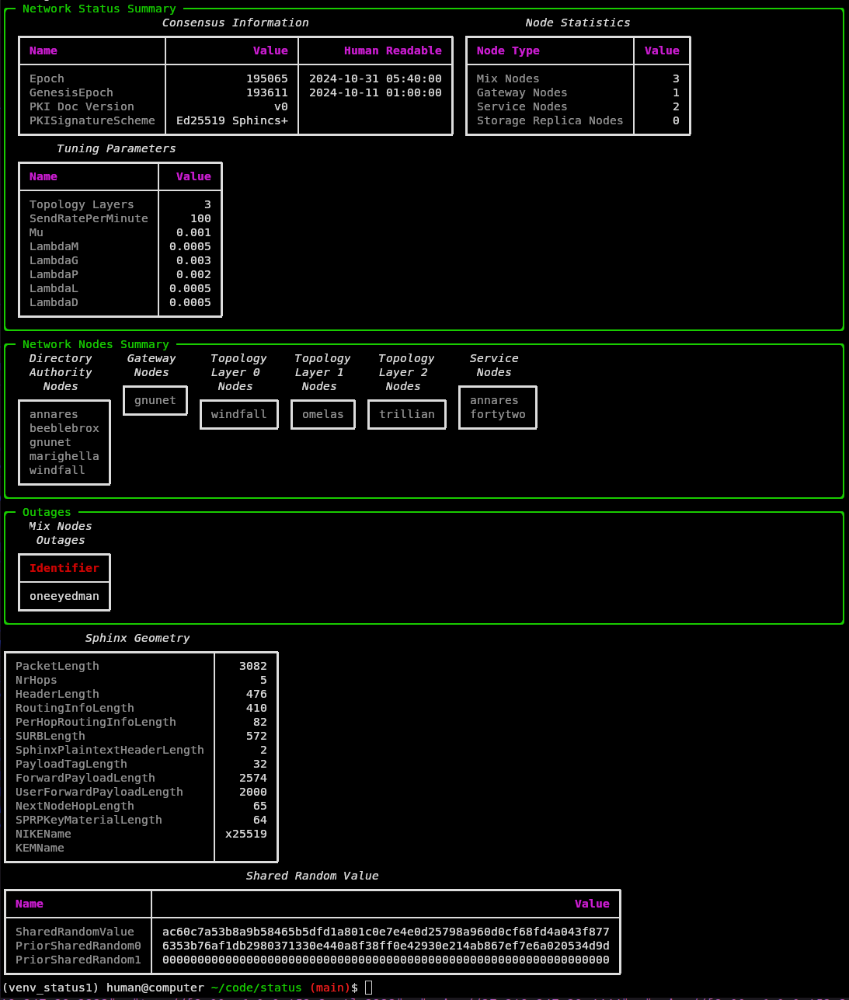

# status

*minxnet diagnostics and status page for katzenpost mix networks*

---




works with Katzenpost version v0.0.41 or later


## Installation / Depedencies

**worldmap** depends on the thinclient which requires you
to run a katzenpost client2 daemon. Build `kpclientd`:

```bash
git clone https://github.com/katzenpost/katzenpost.git
cd katzenpost/cmd/kpclientd
go build
```

Run the client daemon first:

```bash
./kpclientd -c /home/human/client2.toml
```


### Commandline Usage

```
Usage: status [OPTIONS]

Options:
  --config TEXT       Path to the thin client TOML config file.  [required]
  --htmlout TEXT      Path to output HTML file.
  --dirauthconf TEXT  Path to the directory authority configuration TOML file.
                      [required]
  --help              Show this message and exit.
```


### Example Usage


```bash

status --config ~/code/mymixnet/configs/thinclient.toml --dirauthconf ~/code/mymixnet/configs/dirauth1.toml --htmlout network_status.html
```

# Example deployment for status.namenlos.network

## Add a `katzenpost-status` user that can update the status web page
```bash
useradd --system --home /var/lib/katzenpost-status \
  --shell /usr/sbin/nologin --user-group katzenpost-status
mkdir -p /var/www/status.namenlos.network
chown katzenpost-status:katzenpost-status /var/www/status.namenlos.network
chmod 0755 /var/www/status.namenlos.network
```

## Add a `/etc/systemd/system/kpclientd.service` systemd service
```
[Unit]
Description=Katzenpost thin client daemon
After=network-online.target
Wants=network-online.target

[Service]
User=katzenpost-status
Group=katzenpost-status

ExecStart=/usr/local/bin/kpclientd -c /etc/katzenpost/client2.toml

Restart=on-failure
RestartSec=5s

NoNewPrivileges=yes
PrivateTmp=yes
ProtectSystem=full
ProtectHome=true
ProtectKernelTunables=yes
ProtectKernelModules=yes
ProtectControlGroups=yes
RestrictAddressFamilies=AF_INET AF_INET6 AF_UNIX
RestrictRealtime=yes
LockPersonality=yes
MemoryDenyWriteExecute=yes

[Install]
WantedBy=multi-user.target
```

## Add a `/etc/systemd/system/katzenpost-status.service` systemd service
```
[Unit]
Description=Generate Katzenpost status HTML page
Requires=kpclientd.service
After=kpclientd.service

[Service]
Type=oneshot
User=katzenpost-status
Group=katzenpost-status

ExecStart=/usr/local/bin/uv run --directory /var/lib/katzenpost-status/src/katzenpost-status/ status --config /etc/katzenpost/thinclient.toml --dirauthconf /etc/katzenpost/authority.toml --htmlout /var/www/status.namenlos.network/index.html

Nice=10
```

## Add a `/etc/systemd/system/katzenpost-status.timer` systemd timer
```
[Unit]
Description=Run Katzenpost status generator every 15 minutes

[Timer]
OnCalendar=*:0/15
Persistent=true
Unit=katzenpost-status.service

[Install]
WantedBy=timers.target
```

## Reload systemd services
```
systemctl daemon-reload
systemctl enable --now kpclientd.service
systemctl enable --now katzenpost-status.timer
```

# License

AGPLv3
